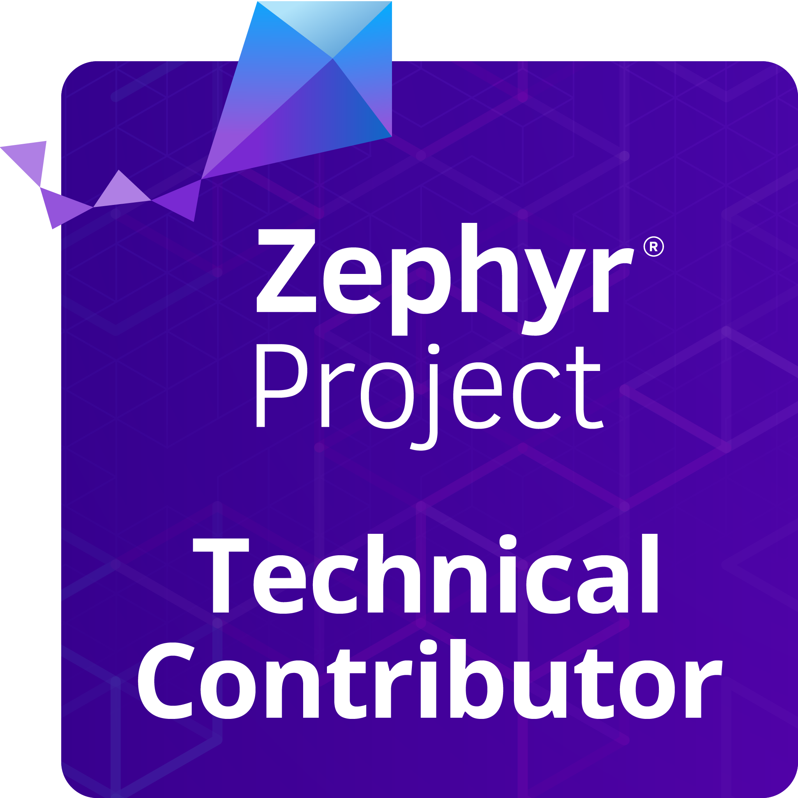

# 🙇About Me

Hello! I'm an Embedded Software Engineer with over 5 years of experience in developing firmware using C/C++ for memory-constrained devices and designing robust embedded systems. My expertise extends to Python microservices and edge AI, where I blend hardware and software to create innovative, smart solutions. I thrive on transforming ideas into reality and love tackling complex challenges in the embedded world. 

In my free time, I enjoy exploring new technologies and contributing to open-source projects that push the boundaries of what's possible in embedded systems. 

Let's connect and explore how we can collaborate to build something extraordinary!

## 🏅 Achievements

<table>
  <tr>
    <td>
      
    </td>
    <td>
      <strong>Zephyr Technical Contributor Badge</strong> 
      Recognized for my contributions to the Zephyr Project, demonstrating my commitment to advancing open-source embedded systems.
    </td>
  </tr>
</table>

# 💻Tech Stack

| **Category**            | **Skills**                                                                                         |
|-------------------------|----------------------------------------------------------------------------------------------------|
| **Programming Languages** | C, C++, Python, HTML                                                                              |
| **Cloud Platforms**     | **AWS** (including AWS IoT Core, S3, Dynamo, EC2), **Azure** (including Function App, Storage Accounts, Key Vault)                   |
| **Embedded Systems**    | STM32, Quectel, PIC, ATmega, ESP32, GSM/GRPS, GPS, WiFi, Flash, SRAM, RTC, RF modules                    |
| **Communication Protocols** | SPI, I2C, UART, RS232, RS485, MQTT                                                                      |
| **Software Tools**      | VS Code, Keil uVision, MPLAB, AVR Studio, Proteus, MATLAB, Simulink, OrCAD, EagleCAD, System Workbench for STM32, STM32CubeMX, Eclipse, DataGrip |
| **Messaging Protocols** | MQTT, Apache Kafka, RabbitMQ                                                                       |
| **Database Tools**      | DynamoDB, MongoDB, PostgreSQL                                                                      |
| **Version Control**     | GitHub, GitLab                                                                                     |
| **Project Management**  | Jira, ClickUp  

## 🌡️My GitHub Vitals

<!-- # 📊GitHub Stats :
 
 
 -->

## 🏆GitHub Trophies

<!-- -->

## 🌐Socials

    

## ✍️Random Dev Quote

---

